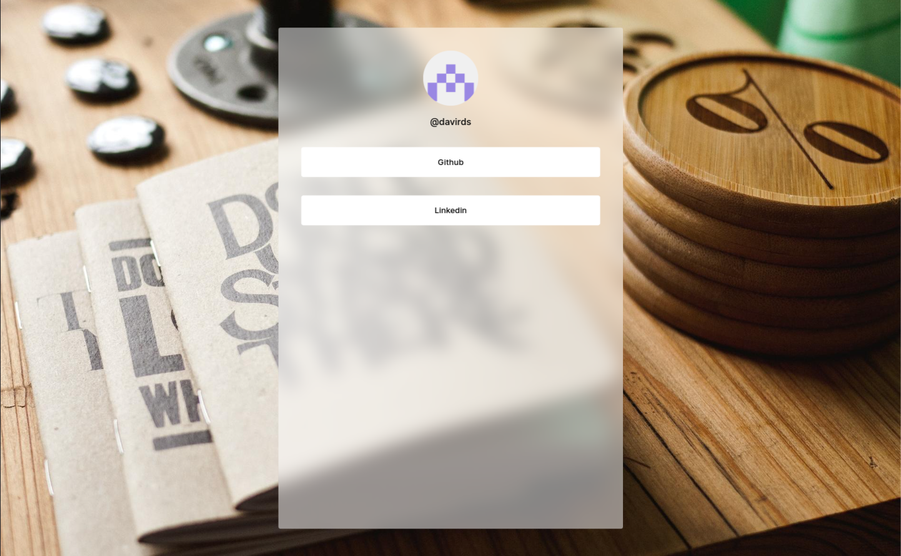

# Linktree Clone



**| React JS**

**| Typescript**

**| Tailwind CSS**

---

## Setup

### clone the repository

```bash
git clone https://github.com/daviramosds/linktree-clone
```
### go to the project folder

```bash
cd linktree-clone
```

### create a ".env.local" based in the ".env.example"

```bash
touch .env.local
```
### install packages

```bash
yarn
```

### start the project

```bash
yarn dev
```

### Done!!!